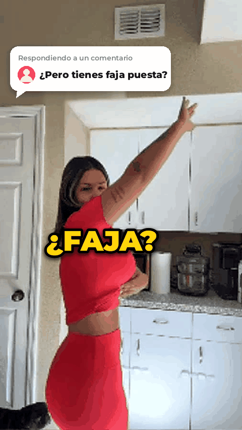

# GIF para la landing: Anti-Inflammatea Loose Tea



| Archivo | Para qué |
|---|---|
| `anti-inflammatea.gif` | El GIF (480×854, 13.6 s, 1.5 MB, en bucle) |
| `anti-inflammatea.webm` | El mismo video en WebM (≈630 KB); carga más rápido |
| `poster.jpg` | Primer cuadro, sirve de portada mientras carga |
| `generar_gif.py` | Regenera todo (`pip install Pillow numpy` y luego `python3 generar_gif.py`) |

## Ángulo elegido: "¿Faja? No, es mi té"

Se aprovecha el comentario escéptico del video ("Pero tienes faja puesta") y se
convierte en la prueba de venta:

1. **Gancho (0–1.6 s):** sticker de respuesta al comentario + "¿FAJA? 🤭". La
   objeción que ya tiene quien mira es la que se contesta. El primer cuadro
   ya lleva el gancho, así que funciona aunque el GIF tarde en cargar.
2. **Prueba (1.6–4.9 s):** acercamiento a la cintura: "CERO FAJA, MIRA 👀" y luego
   "ES QUE YA NO ANDO INFLAMADA". Así lo dice la clienta latina: "inflamada".
3. **Ritual (4.9–7 s):** "MI SECRETO: 1 TAZA DESPUÉS DE COMER ☕". Un uso
   concreto y fácil, que es cuando más se nota la hinchazón.
4. **Mecanismo (7–8.7 s):** "CÚRCUMA + JENGIBRE + MENTA". Los ingredientes dan
   credibilidad: son los que la gente ya asocia con la inflamación.
5. **Resultado (8.7–10 s):** primer plano de la cintura: "ADIÓS PANZA HINCHADA ✨".
6. **Cierre (10–13.6 s):** "NO ES FAJA, ES MI TÉ" + tarjeta del producto
   (orgánico, sin cafeína, 40–50 tazas por bolsa de 4 oz; si vendes otro
   tamaño, cámbialo en el script) + botón "PÍDELO HOY" que late y una flecha
   que señala tu botón de compra real, justo debajo del GIF.

Por qué este ángulo y no otro: el formato "respondiendo a un comentario" se ve
como contenido real y no como anuncio. Además combina los ángulos que mejor
convierten en UGC (problema→solución, prueba social y objeción resuelta) en un
solo hilo que se entiende sin sonido.

**Cuidado con las promesas:** el texto habla de la *hinchazón* y la *digestión*
("apoyar", "calmar"), no de bajar de peso ni de curar nada, y lleva la nota
"Testimonio personal · Los resultados pueden variar". Así evitas rechazos de
Meta/TikTok y problemas con la FTC. No agregues "bajas tallas" ni "quemas grasa".

## Cómo ponerlo en Shopify

1. **Contenido → Archivos → Subir archivos** y sube `anti-inflammatea.gif`
   (y, si quieres, `anti-inflammatea.webm` y `poster.jpg`).
2. En la landing, colócalo **justo encima del botón "Agregar al carrito"**: la
   flecha del final apunta hacia abajo, hacia ese botón.
3. Opción ligera (recomendada en móvil): en una sección de *Liquid personalizado*:

```html
<video autoplay muted loop playsinline poster="URL_DE_poster.jpg"
       style="width:100%;max-width:480px;display:block;margin:0 auto;border-radius:12px">
  <source src="URL_DE_anti-inflammatea.webm" type="video/webm">
  
</video>
```

   Cambia cada `URL_DE_…` por el enlace que te da Shopify al subir el archivo.
   Si el navegador no puede con el WebM, se muestra el GIF.

## Cambiar cosas

- **Foto real del producto:** guarda la foto de la bolsa como `producto.png`
  (mejor con fondo transparente) en esta carpeta y vuelve a correr el script.
  La tarjeta final la usa en lugar del dibujo de la taza.
- **Textos y tiempos:** están en `ESCENAS` al principio de `generar_gif.py`
  (palabra, segundo en que entra y color).
- **Para probar (A/B):** deja todo igual y cambia solo el gancho. Por ejemplo,
  "¿TE INFLAMAS DESPUÉS DE COMER?" en lugar de "¿FAJA?". En el panel Dwell
  mira en qué versión llega más gente a la sección del botón.

Fuentes: Montserrat y Noto Emoji (licencia SIL OFL, en `fuentes/`).
